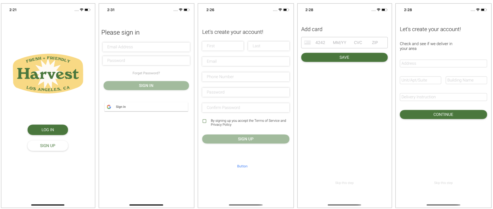
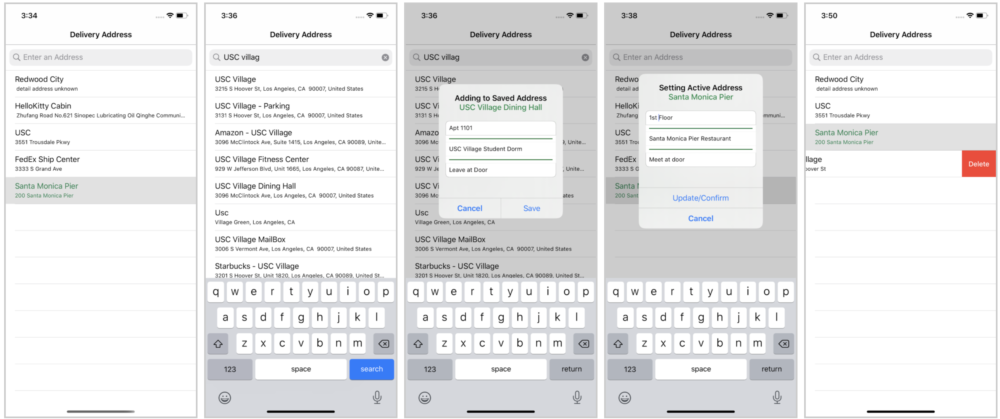
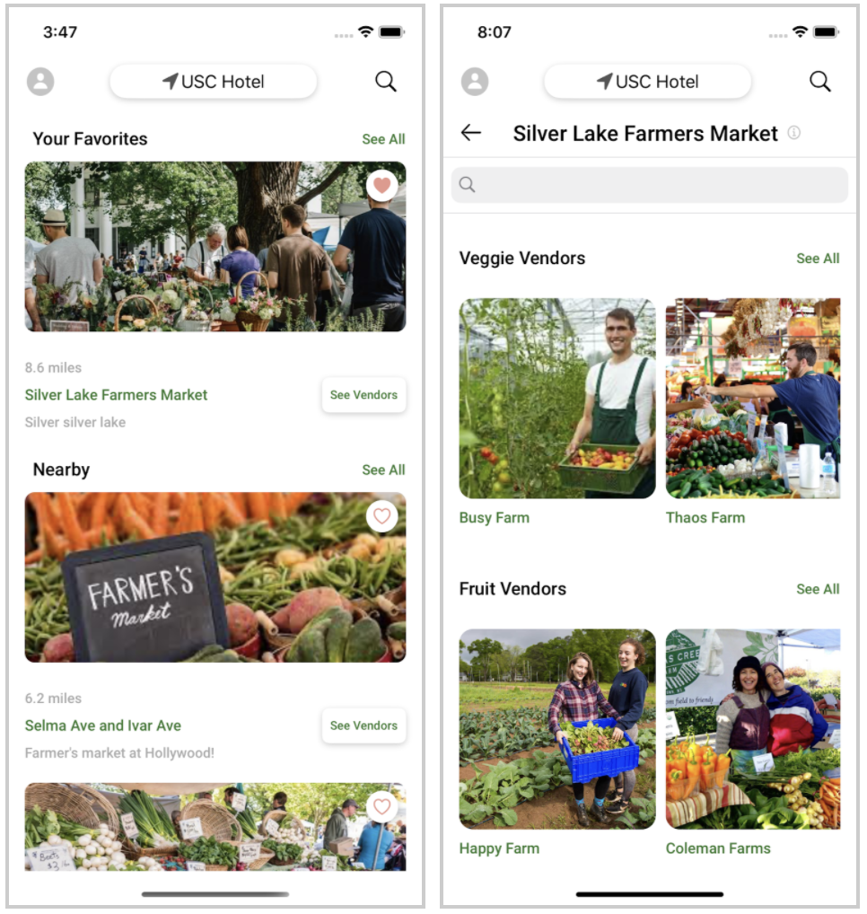
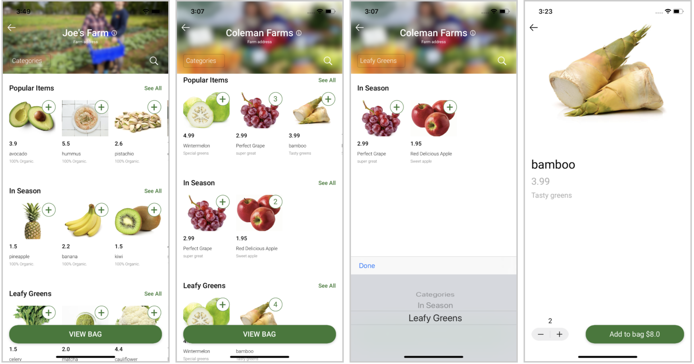
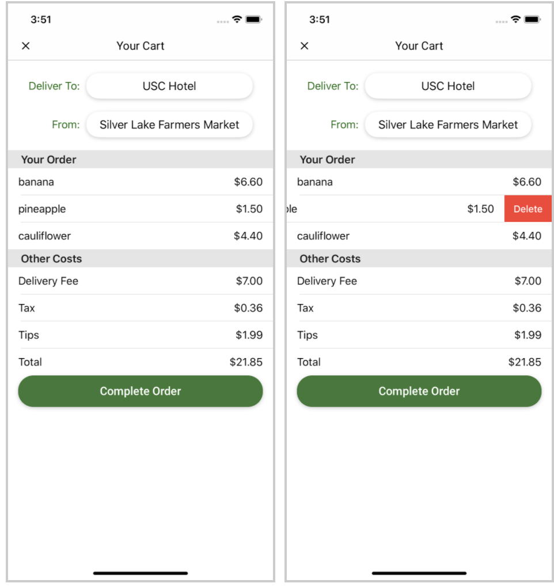
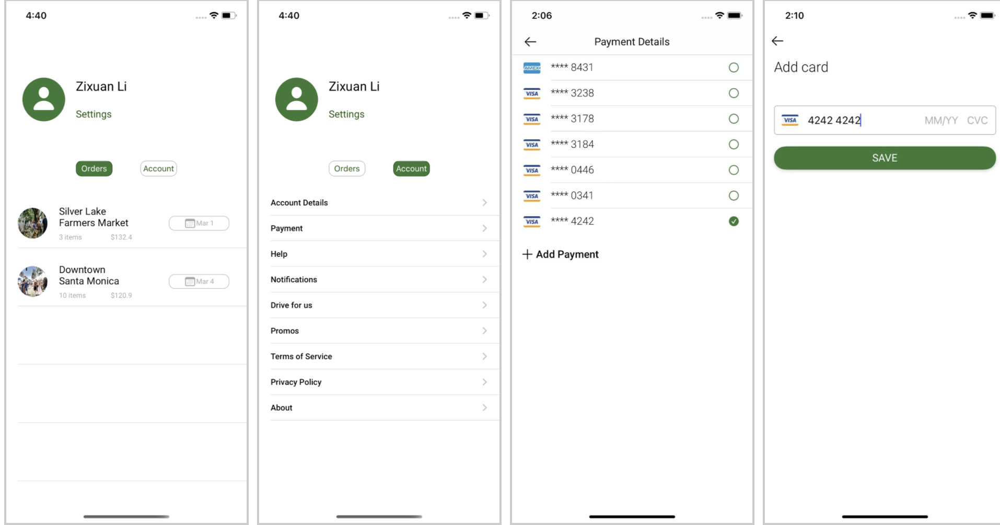

# Harvest - Farmer’s Market Delivery Service

## Description
Here at Harvest, we believe that farm fresh should be for everyone. Harvest aims to deliver the best quality produce right to your door no matter the weather, location or time. We work directly with Farmers’ Markets and local farmers to provide Angelenos a convenient way to order fresh and local produce as easily as any take-out meal.

Harvest is an iOS app that provides farm produce delivery service, similar to popular apps, such as “Postmates” and “DoorDash.” Harvest was founded by 4 Iovine and Young Academy students at USC. Over six months, the team has been conducting research, connecting with business partners, testing the product, and preparing clickable prototypes. 

Harvest is developed in two applications for both customer and business versions, where the business version provides service to the farm vendors and the drivers.

The major features of **Harvest - Customer Side** include:
- Users can browse different markets and choose from available vendors, browse selection and edit quantity, add to cart and pay for product and delivery fee.
- Users can schedule delivery date/time if markets are not open.
- Users can receive updates on delivery, message and tip drivers.

## What our app looks like - Customer Side
                
                  
             
                     

                
                  
             
                     

## To run the iOS app
1. Open Xcode
2. Git clone the project and open the project workspace in Xcode
3. Open command line and go to the project directory
4. Pod install (You need to have cocoapods first)
5. Build and Run the project on Xcode
6. The simulator should pops up, open the Harvest app
7. Have fun!

## Project contributor
- Zixuan Li zixuanli@usc.edu
- Lihan Zhu lihanzhu@usc.edu
- Denny Shen dennyshe@usc.edu
- Jiayang Li jli686@usc.edu

## Credentials
Plase contact Lihan for Firebase and Stripe credentials. Currently, the billing plan of Firebase is switched to "Free" but the Cloud Functions and Cloud Storage services may require "Pay as you go" plan.
