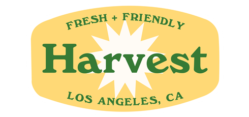

# Swift_Delivery_App_Project
## This is the work our final project of the capstone course: Design and Construction of Large Software Systems at USC

## Harvest is an iOS app that provides farm produce delivery service, similar to other popular apps such as “Postmates” and “DoorDash.” Harvest was founded by 4 Iovine and Young Academy students at USC. Over six months, the team has been conducting research, connecting with business partners, testing the product, and preparing clickable prototypes. 
## As the Harvest development team, we, 4 Viterbi students, designed and developed two applications for Harvest--customer side and business side--where the business version provides service to the farm vendors and the drivers.
## Here are the contact info of my teammates: lihanzhu@usc.edu jli686@usc.edu zixuanli@usc.edu
